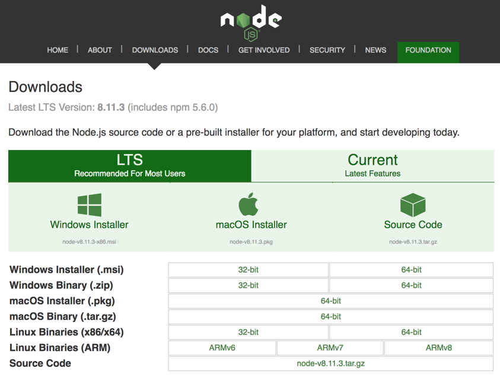
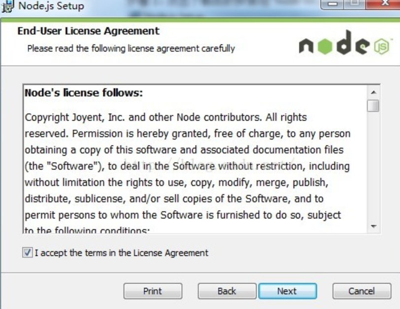
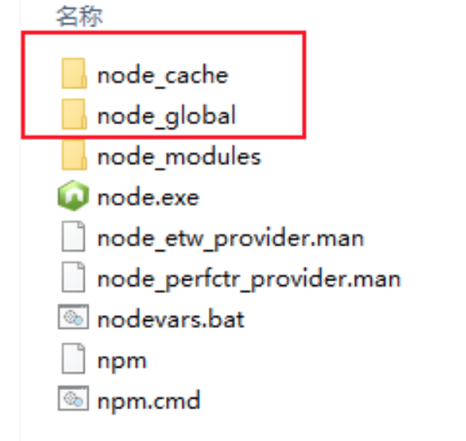
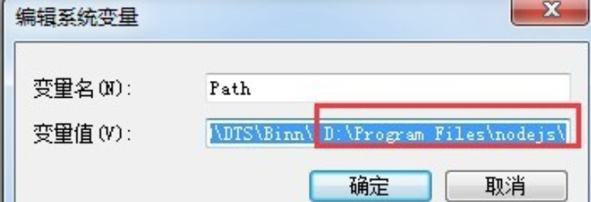
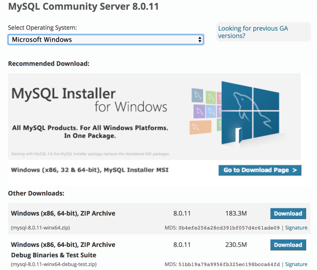
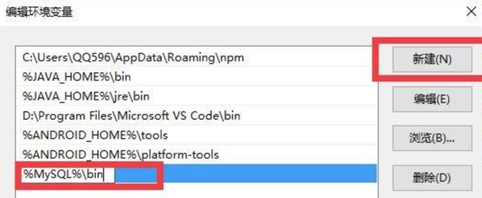
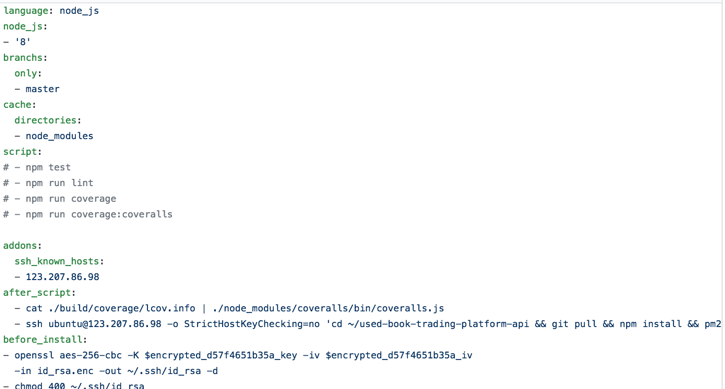

# 安装部署说明书

## 1. 摘要

#### 1.1 编写目的

本手册详细叙述本系统的部署和实施中的步骤与注意事项，包括系统运行环境、系统部署相关的软件要求、数据库和编译部署工具的软件安装等内容。安装人员在进行实际安装前务必详细阅读本手册。

#### 1.2 安装规划

本手册详细叙述本系统的部署和实施中的步骤与注意事项，包括系统运行环境、系统部署相关的软件要求、数据库和编译部署工具的软件安装等内容。安装人员在进行实际安装前务必详细阅读本手册。本系统计划安装服务端、数据库和web端，其中服务端通过8080端口访问，因此需要对主机中的防火墙进行相应的端口开放设置。 

## 2. 运行环境

#### 2.1 服务端运行环境要求

服务端运行的环境要求Nodejs版本在9以上。 

#### 2.2 Web端运行环境要求

Web端需要下载chrome 最新版本。

## 3. 系统部署

#### 3.1 服务端部署

首先需要下载安装pm2。

1.     输入指令：

npm install -g pm2

2.     启动应用可输入指令：

pm2 start app.js

安装好pm2后，输入指令：startOrRestart ./config.json 即可完成服务端的部署。

#### 3.2 Web端部署

运行web之前需要提前安装node.js，下面以windows环境下的配置为例。

1.     登录node官网，选择nodejs 9.0以上的版本进行下载，若操作系统为windows，注意区分32bit和64bit。

 

2. 打开下载好的安装包，默认下载配置，可自定义安装目录，因后续环境配置需要用到安装路径，请牢记目录路径。

   

3. 目前新版的node已经集成npm，因此在安装node时np也安装好了，无需单独安装npm。

4. 在命令行中输入node可进入开发者模式，输入指令 ‘node -v’可检测node，输入指令 ‘npm -v’可检测npm，输入指令 ‘.exit’可退出命令行模式。

5. 安装成功后需要进行nodejs的配置，首先配置npm的全局模块存放路径以及cache。在nodejs的安装主目录中新建文件夹 node_cache 和 node_global。 

   

6. 在命令行中输入指令：

npm config set prefix “安装路径\nodejs\node_global”

npm config set cache “安装路径\nodejs\node_cache”

7.     进行模块安装：选择安装express模块，在命令行输入指令：

npm install express -g

8.     查看系统环境变量：鼠标右键单击我的电脑→属性→高级系统设置→环境变量→在系统变量下新建NODE_PATH并输入:

“安装路径\nodejs\node_global\node_modules”

9.     重新打开命令行窗口，输入指令：node require(‘express’)测试node模块的全局路径是否配置正确。

10.  若报错则表明环境配置错误，请再次核对以上配置过程，若无误，可尝试在用户环境变量下新建node_path，输入：

“安装路径\nodejs\node_global\node_modules”

## 4. 程序部署

#### 4.1 数据库部署

下载安装mysql

首先需要下载安装MySQL，下面以操作系统windows环境为例进行下载安装步骤阐述：

1.     登录MySQL官网，选择合适的版本进行下载，若操作系统为windows，注意区分32bit和64bit。

 

2.     解压下载好的MySQL Server压缩包，并将解压后的文件夹放置在合理位置。

3.     配置MySQL Server的环境变量：

1)    鼠标右键点击菜单按钮，选择“系统”选项

2)    在“系统”界面左侧，选择“高级系统设置”

3)    在打开的“系统属性”对话框中的“高级”选项卡页面的下方，选择“环境变量” 

4)    在“用户变量”区块中，选择“新建”，在打开的对话框中，变量名写 MySQL，变量值写 MySQL 文件夹的完整路径

5)    同样在用户区块中寻找 PATH 环境变量，如果有，点击“编辑”。在弹出的对话框中点击“新建”，输入%MySQL%\bin（在老版本 Windows 系统中，变量值末尾用英文分号; 分开后再添加%MySQL%\bin）。如果没有，点击“新建”，添加一个变量名为 Path 的环境变量。在这个环境变量的变量值处添加%MySQL%\bin

6)    点击确定按钮推出环境变量配置对话框

7)    点击确定按钮推出系统属性配置对话框

4.     注册MySQL服务

1)    鼠标右键点击菜单按钮，选择“命令提示符”选项

2)    输入输入盘符 + “:” 指令，进入MySQL文件夹所在的磁盘（本教程是 D 盘）。再使用 cd指令进入MySQL Server所在文件夹的bin文件夹中

3)    执行 mysqld -install 指令，注册MySQL服务

5.     配置MySQL Server

1)    进入MySQL Server 所在的文件夹

2)    编辑 my-default.ini，去掉 basedir 的注释符号，并在等号后边填写 MySQL Server 文件夹的完整地址；去掉 datadir 的注释符号，并在等号后边填写 MySQL Server 文件夹的完整地址外加\data

3)    保存退出后将my-default.ini重命名为my.ini

4)    命令行执行指令：mysqld --initialize

6.     输入指令：net start mysql，启动MySQL Server

7.     导入init.sql文件，用户名为root，密码为12345678

#### 4.2 编译工具部署

Ts-node和 nodejs

编译工具主要用到ts-node以及nodejs，nodejs已经在web端部署中描述过，这里不再赘述，下面对ts-node的部署流程进行详细阐述：

1.     安装ts-node。输入指令：npm I -D typescript ts-node 

2.     创建app.ts文件。输入指令：console.log(1)

3.     调用命令 ts-node app.ts，验证ts-node是否正常安装。

#### 4.3 部署工具部署

项目使用了持续集成工具Travis进行构建和部署，下面对travis的配置进行阐述：

1. 在travis-ci官网注册账号后，在github中的项目可选择是否进行持续集成

2. 持续集成的配置需要通过.travis.yml进行。需要确定项目的语言、开发环境等内容

3. 相关的依赖包可在before_install中进行

   

4. 项目分支的限制在brainches中指定

5. 构建travis需要在script命令中指定

6. 进行travis的部署，首先需安装、配置vsftpd，执行指令：sudo apt-get install vsftpd

7. 配置vsftpd，通过修改/etc/vsftpd.conf完成

8. 允许服务器本地用户使用ftp，设定用户的local_enable = YES

9. 开启写入操作：write_enable = YES

10. 配置Travis使用ftp部署，在script命令执行成功后，添加after_success

