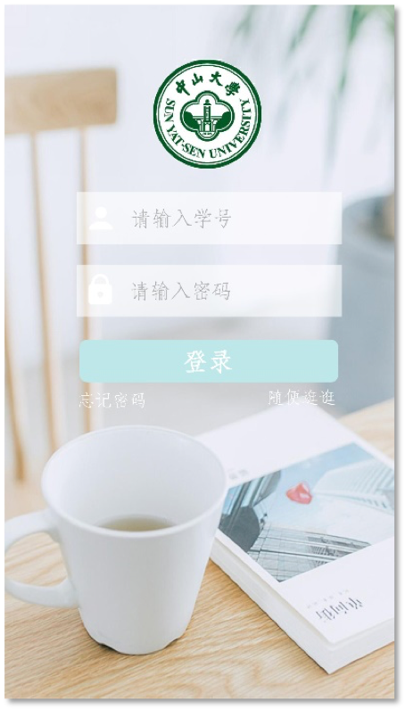
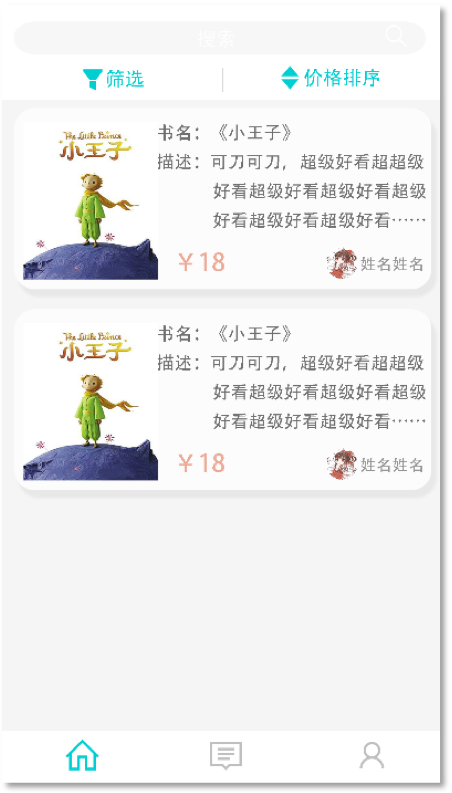
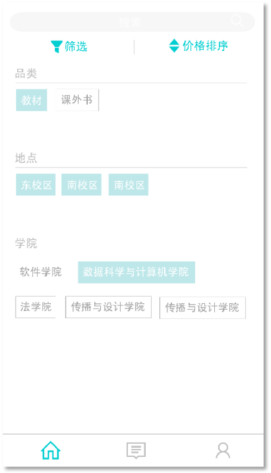
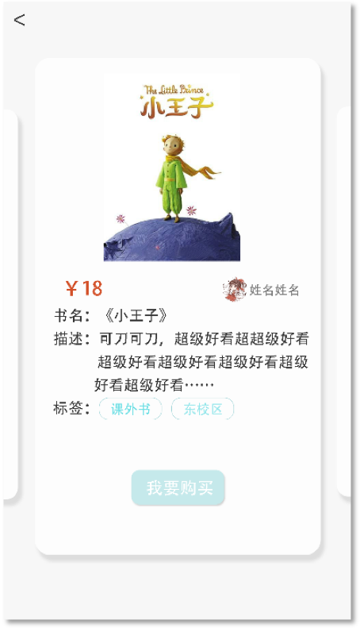
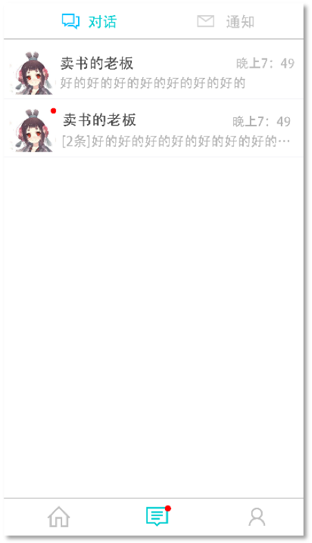
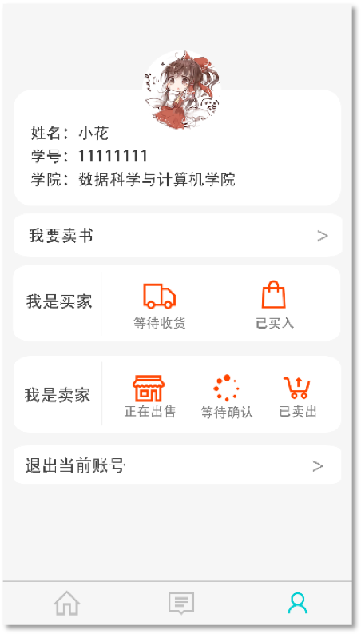
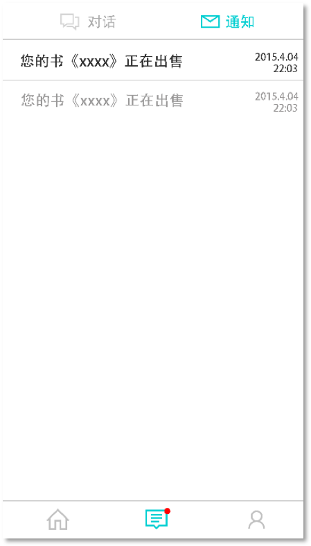

# 用户手册

## 1. 引言

### 1.1 编写目的

本文档编写的目的是充分叙述本软件所能实现的的功能及其运行环境，以便使用者了解本软件的使用范围和使用方法，并为软件的接下来的开发提供必要的信息。

## 2. 软件概述

### 2.1 产品概述

这是一款面向中山大学学生的二手书交易平台，在该交易平台上，低年级同学可以满足对二手教科书或课外书的购买需求，高年级同学可以找到更高效有利的方式处理闲置二手教材，实现高效资源的利用，使得校园生活更加便利。 

### 2.2 产品运行

本产品运行在PC机上，支持多种操作系统。

### 2.3 安装部署配置

参照《安装部署说明书》进行相应操作。

## 3.产品使用教程

### 3.1 注册与登录

注册时请输入学号、身份证后六位、初始密码等信息。

登录时请输入学号以及设置的密码。

### 3.2 查看图书列表

初始界面便是图书列表，可以查看现有书籍的简略信息。

### 3.3 筛选界面

点击上方“筛选”按钮可进入筛选界面

### 3.4 图书详情界面

点击进入某本图书后，可查看该图书的详细信息。

### 3.5 对话界面

可在对话界面中与卖家/买家进行沟通交流

### 3.6 个人界面

可在个人详情界面修改个人信息、查看订单详情、发布图书等操作。

### 3.7 通知界面

通知栏中会实时通知目前订单信息，包括发布图书的订单信息以及购买图书的订单信息。

