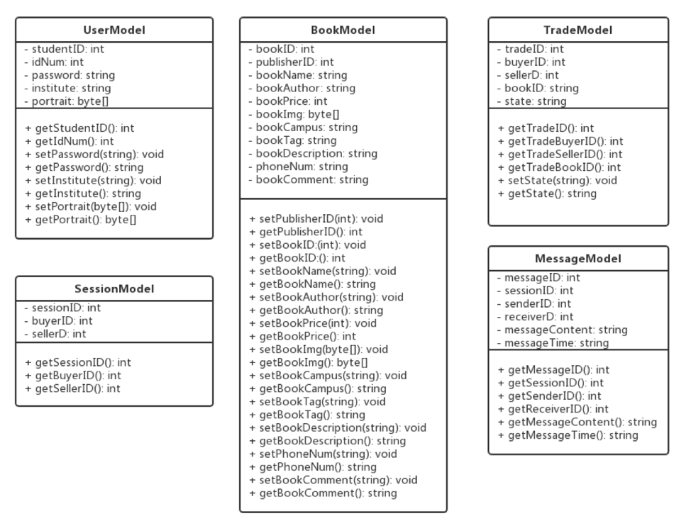

## 软件设计文档

#### 小组成员：赖秀娜 15331141 朱传博 15331437 邹 琳  15331447  曾志贤 15332003

### 1. 开发规划

#### 1.1 开发计划

1.需求调研：在需求调研阶段，我们小组在经过几次会议讨论后，初步确定项目研究主题，并分工进行市场需求调研。在需求调研方面我们采用了面对面访谈、查找网络资料等方式进行。

2.需求调查：在需求调查阶段，我们根据调研得到的需求统计结果进行初步分析，大致确定功能性需求的框架模块，初步确定基本购书、卖书流程。

3.需求分析：在需求分析阶段，我们对得到的需求统计结果进行分析和讨论，同时结合现有的二手书交易平台，根据结果总结结论，进行具体的用例析取，初步攥写问题陈述及用例归约，绘制用例图、UML图等，攥写《需求规格说明文档》及《软件设计文档》，确定准确、无二义性的用例及需求。

4.系统设计：根据需求分析结果，我们进入了系统设计阶段，开始设计产品的架构模型，进行数据库设计，统一编程语言及编程风格，建立Github仓库便于代码管理，进行部件设计等流程。

5.产品设计：系统设计阶段基本完成后，小组内的设计成员对产品的页面进行了ui设计，确定ui风格。

6.产品开发：结束产品设计阶段后，正式进入产品开发阶段。在该阶段中，根据分工，我们各自承担了产品的各个页面进行同步开发，并与服务端后台进行协商确定接口设计。原型程序开发完成后，小组成员集体对初步产品进行了需求评估，确定产品的需求设计与预期的需求成果无偏差，并讨论确定下一步产品的迭代开发阶段。

7.修改文档：根据对原型程序再一次讨论确定的需求结果，我们对《需求规格说明文档》及《软件设计文档》进行了再修改。

8.产品开发：根据修改的文档，小组成员对产品进行了开发和完善，同时各自进行单元测试。

9.集合测试：在各模块开发完成后，我们进行了模块的整合，并对产品进行了集合测试，排除故障。

10.产品试运行：完成集成测试后，项目进行产品试运行阶段，项目组成员对产品进行试运行，保障产品在无故障的前提下，贴合预期的需求设计。

#### 1.2 开发环境和工具

1.运行环境支持：PC端

2.Web前端支持：

​	1）语言：javascript，CSS3，HTML5

​	2）Web框架支持：Weex、Vue、Vue-router、Vuex框架

3.数据库支持：MySQL

4.开发平台与工具

​	1）编译工具：Ts-node，nodejs

​	2）部署工具：Travis

​	3）代码管理：Github

### 2. 总体设计

#### 2.1 架构设计

本系统采用MVC（Model-View-Controller）模式进行架构设计，实现了一个三层架构模型，包括模型，包括视图（View）、控制器（Controller）和模型(Model)三层。

(1) 视图（View）

视图用户即图形化界面，为用户提供交互界面。

本系统的视图层由以下七个板块构成：

①　登录界面

②　注册界面

③　图书列表界面

④　图书详情界面

⑤　对话界面

⑥　交易信息界面

⑦　个人界面

 

(2) 控制器（Controller）

控制器接收用户的输入并调用模型和视图完成用户的需求。

本系统的控制层由以下四个模块构成：

①　用户注册和登录的控制逻辑。

②　用户发布图书、图书评论的控制逻辑。

③　用户进行图书交易和交易评价的逻辑控制。

④　买家与卖家进行联系的控制逻辑。

 

(3) 模型（Model）

模型封装与应用程序相关的企业数据和业务规则。模型可为多个视图提供数据，重用性高。

本系统的模型层由以下三个数据模块构成：

①　存储用户信息的数据模型，包括学号、密码和聊天记录。

②　存储图书信息的数据模型，包括图书名称、图书作者、关键词、图书图片、图书描述以及联系方式。

③　存储交易信息的数据模型，包括买方信息、卖方信息以及交易的图书信息

#### 2.2 系统部署结构图

#### 2.3 系统总体架构设计图

### 3. 模块列表

#### 3.1 模块划分

├── plataforms                                    
├── test                                         
└── src                                       
　　├── entry.js　　　　　　　　　　# router file                              
　　├── router.js　　　　 　　　　　 # router file                                 
　　├── index.vue　　　　　　　　　# default page                        
　　├── assets      
　　├── components　                                      
　　├── store                          
　　└── pages                                 
　　　　 ├── book　　　　　　　　　# 书籍信息页面                       
　　　　 ├── chat　　　　 　　　　　# 聊天页面                 
　　　　 ├── goods　　　　 　　　　# 货物列表（对应个人信息页面的买卖家导航）                  
　　　　 ├── sell　　　 　　 　　　　# 我要读书页面      　　　　　　　              
　　　　 ├── identity　　　 　 　　　# 未登录前的三个页面                  
　　　　 └── home　　　 　　　　　# 主页                          
　　　　　　 ├── book-list　　　　　# 书籍列表                              
　　　　　　 ├── message　　　　　# 对话与通知                  
　　　　　　 └── profile　　　　　　# 个人信息                               
       
​       
#### 3.2 前端结构

### 4. 接口规范

#### 4.1 Web服务器

- GET /user/login 查询用户登陆信息
- POST /user/login 用户登录
- POST /user/register 用户注册
- GET /book 获取所有书籍
- POST /book 创建图书
- GET /book/{id} 获取图书
- POST /book/{id}/img 上传图书图片
- GET /message/last 获取每个房间的最新消息（message页面用）
- GET /message/{sessionId} 获取一个房间内所有消息
- POST /message/{sessionId} 向一个人发起消息
- POST /message/to/{tid} 向一个人发起消息
- POST /message/session/{tid} 创建房间
- POST /trade/{bookId} 图书交易
- GET /trade 获取所有交易
- DELETE /trade/{tid} 取消交易
- POST /trade/{tid}/send 标记图书开始送货
- POST /trade/{tid}/recieve 标记图书收货

具体api文档见 http://localhost:3000/swagger

#### 4.2 数据库

经分析，本系统的实体类包括用户信息类、图书信息类、交易信息类、会话信息类和消息信息类，其中用户信息包括学号、密码、学院和用户头像；图书信息包括发布用户、图书名称、图书作者、关键词、价格。校区、图书图片、图书描述、图书评论以及联系方式；交易信息包括买方信息、卖方信息以及交易的图书信息和交易状态信息；会话信息包括会话的买方和卖方信息；消息信息包括消息的发送方、接收方、消息内容和发送时间。 

### 5. 部件设计

#### 5.1 分析并发需求

本系统作为一个网页系统，需满足多用户同时登录、注册、访问和使用的需求。

​    假设一个用户相当于一个请求，则本系统的并发需求很大程度由在线的用户数量决定。由于本系统是中山大学校内的二手书交易系统，参与的用户数量级不会特别大，因此系统的并发需求相对较小。总共的用户数量控制最多可达万人，但活跃用户数量预计千人以下，因此可将系统的并发需求控制在：同一时刻最多只有1000人发出请求。

#### 5.2 针对特定需求的设计方案

由于本系统需要考虑并发需求，因此系统包含以下进程和线程 。

#### 5.2.1 进程

主进程：整个系统仅有一个进程构成，系统的入口是进程的入口，进程的生命周期与系统的生命周期一致，当系统结束运行的时候，进程也将结束；如果进程被迫结束，系统也会结束。主线程包括多个线程。 

#### 5.2.2 线程

1)   请求线程（RequestHandler）

​    由于可能存在多个请求，因此需要存在一个请求线程，该线程仅接收所有用户的请求，并将请求放到相应的请求队列中；请求线程不对用户请求做出具体的响应（请求线程相当于一个生产者）。

2)   响应线程（ResponseHandler）

​    请求线程将用户请求存放到一个请求队列中去，而响应线程对队列进行轮询操作，如果发现队列存在用户的请求，则从资源池请求分配资源进行响应（响应线程相当于一个消费者）。

3)   处理线程（HandlerThread）

​    处理线程由资源池进行分配，当响应线程请求一个线程处理请求的时候，如果资源池存在空闲的线程，则将该空闲线程用于处理该请求。

#### 5.3 描述相应的进程和线程

    下图展示了系统的请求处理过程，包括3个部分：请求过程、响应过程、处理过程。 

其中，RequestHandler为请求线程，该线程将所有的请求（Request）放到请求队列（RequestQueue）中；ResponseHandler为响应队列，将RequestQueue中的请求取出进行响应。而RequestQueue队列的请求处理方式对应于生产者和消费者模式：

​    RequestHandler充当生产者，将请求放入到请求队列中，如果请求队列RequestQueue已满，则会阻塞RequestHandler，直至RequestQueue有空余的位置；

​    ResponseHandler充当消费者，从RequestQueue中取出请求。如果RequestQueue为空，则会阻塞ResponseHandler。如果ResponseHandler取出了请求，则从线程池中取出HandlerThread处理请求。

​    线程池ThreadPool是一个固定大小的线程池，不能无限地从中取出HandlerThread进行请求的处理，因为当ThreadPool的线程太多时，容易导致空闲资源的浪费、以及线程切换所带来的CPU资源损耗。

​    HandlerThread线程用于处理每一个请求，每个用户都与一个HandlerThread线程进行对应，HandlerThread处理后将用户请求的结果返回给用户。
